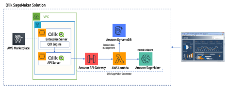
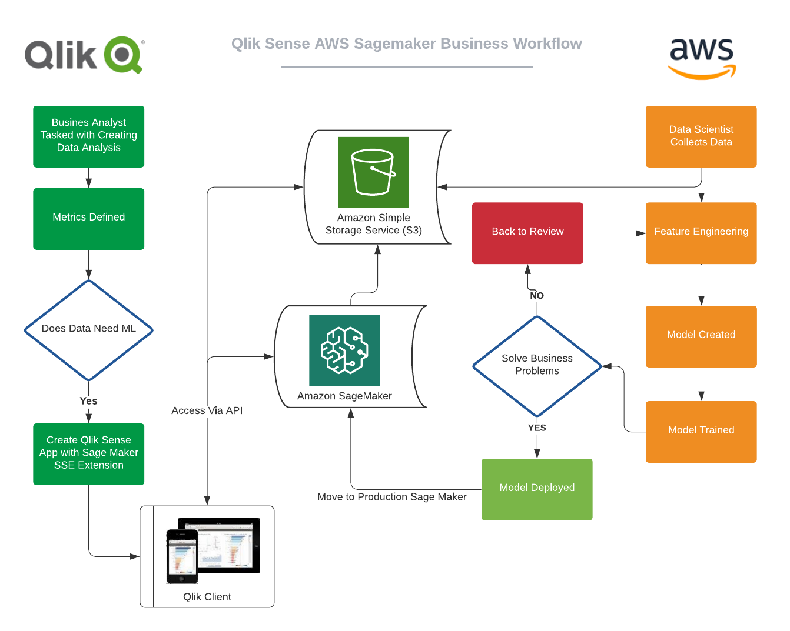
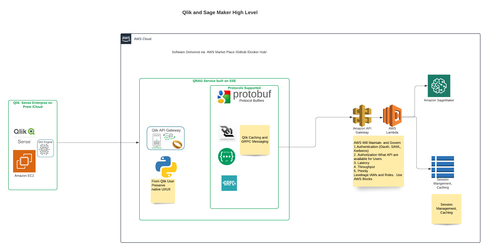

# Integrating Qlik with Sagemaker

Qlik Rapid API Gateway usese AWS Sagemaker Endpoint and AWS Lambda/AWS API Gateway for Integration. The overview of the solution looks like the following.

The Architecture uses modern micro services design patterns leveragin loosely coupled services.
Here is a quick explanation of component and role in the architecture

- AWS Sagemaker - Platform Creating, Training and Publishing Endpoints for ML Models.
- AWS Lambda - Serverless functions to perform row by row data manipulation and facilitate connection to Sagemaker(Sagemaker preferred endpoin is written in BOTO3 Lambda can call BOTO3 functions and manipulate data easily).
- AWS DyanamoDB - Serverless Database Table to perform session management and storage layer for AWSLambda
  \*AWS API Gateway - API managmeent and Access layer for Sagmaker Endpoints.

## Integration Use Cases

In our current release we are using Qlik as a Client of Sagemaker Endpoints. Sagemaker Endpoints are trained ML Models that can respond with predictions based on input data.

_Future Releases are scheduled where Qlik Scripts can send Data to Sagemaker for Additional Training using Sagemaker AutoML Function._

Follwing are Currently Implemented Capbility

1. Single Row Data Scoring in Real Time with Sagemaker
2. Multi Row Data Scroing in Real Time with Sagemaker
3. Interactive/RealTime Scoring as a Qlik Function with Sagemaker
4. Batch Scoring on Sagemaker End Point Using Qlik Script
5. Support of REST and WS version AWS Gateway
6. Batch Size Support on WS API

## Qlik Sagemaker Business Flow

## Architectural Diagram

## Installation and Setup

Qlik Server Setup

QRAG/API Server Setup

AWS Component Setup

Sagemaker Specific Setup

1. Defining functions.json   
    Basis of this implementation uses functions.json file from __Qlik SSE integration__ (Please see reference [here](https://github.com/qlik-oss/server-side-extension)) you must use functions.json to expose integrated ML functions.  The advantage of this implementation is natural feel of integration Qlik users.
      
    Below is sample defition of function.json file located in sagemaker directiory/model.
    
    
    ### FunctionDefinition -Sagemaker
    The definition of a function, which informs the Qlik engine how to use it.

    | Field | Type | Label | Description |
    | ----- | ---- | ----- | ----------- |
    | Id | number | optional | A unique ID number for the function, set by the plugin, to be used in calls from the Qlik engine to the plugin.|
    | Name | string | optional | The name of the function. |
    | Type | Function Type | optional | We will define this as value 2(Tensor) which allows multiple rows in and multiple rows out. |
    | QRAP_Type | Qlik Rapid API Function Type | optional | We will definte this as type of Function i.e. rest_single_ws |
    | ReturnType | DataType | optional | The return type of the function. For Sagemaker we will define all return types as 0(string). (Qlik will be able manipulate the String to Int with in Qlik Engine.|
    | Params | Parameters | repeated | The parameters the function takes. For Sagemaker preffered param is str1:0 where a single row or file has comma delimited string of all defined params. |
    

    
2. Defining qrag.ini
3. Restarting Services
## Testing

Up to 3000 row Bulk Scoring/Single Scoring Real Time
1 million row Batch Scoring via Qlik Script
12 users on App using Real Time Scoring Interface

## Trouble Shooting and Logs

## References
